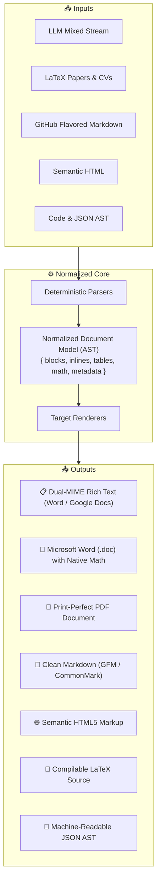

<div align="center">

  

  # Converter

  **The Universal, Privacy-First Document & AST Conversion Engine**

  *Transform messy AI responses, LaTeX mathematics, academic CVs, and code into clean, presentation-ready Word, PDF, Markdown, and HTML — entirely inside your browser.*

  <p align="center">
    <a href="https://github.com/sniperravan"></a>
    
    
    
    
    
    
    
  </p>

</div>

---

## ⚡ Why Converter?

Converting between $N$ different document formats traditionally requires building $N \times (N - 1)$ separate translation adapters. When format specifications diverge or AI chatbots produce chaotic mixed responses, traditional point-to-point converters fall apart.

**Converter solves this through a Normalized Document Object Model (AST):**
Every supported input format is parsed into a single, canonical abstract syntax tree, which is then compiled into any target output format with mathematical precision.



---

## 🛡️ Core Philosophy: 100% Client-Side Privacy

* **Zero Telemetry:** No tracking pixels, analytics beacons, or Google session cookies.
* **100% Offline Runtime:** All parsing, AST compilation, and document generation execute entirely in your browser's local sandbox.
* **Zero Remote Document Upload:** Your sensitive documents, academic papers, proprietary code, and personal resumes never touch an external server.
* **No Logins, No Paywalls:** Full access to all conversion modes, live previews, and export tools permanently free and open source.

---

## ✨ Standout Capabilities

### 1. 🤖 Dedicated LLM Mixed Stream Engine
AI models (ChatGPT, Claude, DeepSeek, Gemini) frequently produce non-standard hybrid syntax:
* **LaTeX Formula Normalization:** Seamlessly harmonizes `\[...\]`, `$$...$$`, `\(...\)`, and `$...$` delimiters.
* **ASCII Box Table Conversion:** Automatically transforms plain-text terminal tables (`+---+`, `|---|`) into formatted semantic data grids.
* **Self-Healing Code Fences:** Resolves unclosed code blocks and embedded HTML tags on the fly without breaking formatting.

### 2. 🎓 Overleaf & Academic LaTeX Resume Support
Built-in AST macro expanders designed to parse real-world Overleaf resume templates (such as *Jake's Resume* and *sb2nov*):
* **Custom Macro Expansion:** Accurately extracts `\resumeSubheading`, `\resumeProjectHeading`, `\resumeItem`, and `\resumeItemListStart`.
* **FontAwesome Glyphs:** Transpiles `\faGithub`, `\faLinkedin`, `\faEnvelope`, `\faPhone`, `\faMapMarker`, and `\faGlobe` into universal symbols with live hyperlinks.
* **Balanced-Brace Parser:** Handles arbitrary nested braces and font sizes (`\textbf{\Huge \scshape \color{primary} ...}`) without regex truncation or token leakage.

### 3. 🔍 Interactive Pre-Flight Export Modal
Never guess what your download will look like. Clicking **Export** opens an interactive live inspection modal:
* **Word & PDF:** Realistic paginated paper sheet mockup displaying margins, drop shadows, and rendered math.
* **HTML:** Real-time dual toggle between a styled visual page and syntax-highlighted source code.
* **Markdown, LaTeX & JSON:** Monospace code inspector with instant word count and estimated payload size.
* **Customizable Naming:** Edit file basenames with locked extension badges before saving.

### 4. 📋 Dual-MIME Rich Text Clipboard
The **"Copy Rich Text"** button injects a dual-mime clipboard payload (`text/html` + `text/plain`). Paste formulas, headers, bold text, and tables directly into:
* Microsoft Word & Word Online
* Google Docs & Google Sheets
* Notion & Obsidian
* Slack & Apple Pages

### 5. 📬 Anonymous Community Issue Reporting
Found a tricky syntax edge case? The in-page **Issues** section connects directly to a private Google Sheets webhook:
* Requires zero GitHub accounts and zero Google sign-ins.
* Collects zero visitor telemetry or IP tracking.

---

## 📊 Supported Formats Matrix

| Format | Ingestion (Input) | Live Preview | Direct Export | Clipboard Action |
| :--- | :---: | :---: | :---: | :---: |
| **LLM Mixed Stream** | ✅ Full Parser | ✅ Rich Preview | — | 📋 Dual-MIME Rich Text |
| **Rich Text (WYSIWYG)** | — | ✅ Interactive | 📄 Word (`.doc`), PDF (`.pdf`) | 📋 Dual-MIME Rich Text |
| **Markdown (GFM)** | ✅ Auto-Detect | ✅ Live Syntax | 📝 Markdown (`.md`) | 📋 Raw Source |
| **HTML5** | ✅ Semantic AST | ✅ Dual-Mode View | 🌐 HTML Document (`.html`) | 📋 Raw Source |
| **LaTeX Mathematics** | ✅ KaTeX + Macros | ✅ Live Equations | 📐 LaTeX (`.tex`) | 📋 Raw Source |
| **JSON AST** | ✅ Validated DOM | ✅ Tree View | 🌳 JSON AST (`.json`) | 📋 Minified / Formatted |
| **Plain Text & Code** | ✅ Universal Ingest | ✅ Monospace View | 📄 Text (`.txt`) | 📋 Raw Text |

---

## 🛠️ Architecture & Tech Stack

```text
Convertion/
├── src/
│   ├── core/           # Normalized Document AST types & document statistics
│   ├── parsers/        # Modular syntax parsers (LLM, Markdown, LaTeX, HTML, JSON)
│   ├── renderers/      # AST compiler targets (Rich Text, HTML, Markdown, LaTeX, Text)
│   ├── components/     # High-performance React 19 UI & Canvas elements
│   │   ├── Header.tsx             # Responsive sticky navbar with active scrollspy
│   │   ├── Workspace.tsx          # 2-column side-by-side editing studio
│   │   ├── RichPreview.tsx        # KaTeX formula & table previewer
│   │   ├── ExportPreviewModal.tsx # Pre-flight document sheet inspector
│   │   └── IssueReportSection.tsx # Zero-telemetry anonymous issue logger
│   ├── store/          # Zustand global converter state & reactive preferences
│   └── utils/          # Native file exporters (Word, PDF, HTML, LaTeX)
```

* **Runtime:** [React 19](https://react.dev/) + [TypeScript](https://www.typescriptlang.org/) + [Vite](https://vitejs.dev/)
* **Styling:** [Tailwind CSS](https://tailwindcss.com/) with adaptive dark/light mode & frosted-glass backdrops
* **Formula Engine:** [KaTeX](https://katex.org/) for rapid browser-side mathematical typesetting
* **Icons:** [Lucide React](https://lucide.dev/)
* **State Management:** [Zustand](https://github.com/pmndrs/zustand)

---

## 🚀 Getting Started Locally

### Prerequisites
* [Node.js](https://nodejs.org/) v18.0 or higher
* `npm` or `pnpm`

### Installation & Development

```bash
# 1. Clone the repository
git clone https://github.com/sniperravan/Convertion.git
cd Convertion

# 2. Install dependencies
npm install

# 3. Launch the Vite development server
npm run dev
```

Open `http://localhost:5173` in your browser.

### Production Build & Linting

```bash
# Verify type safety and build optimized static assets
npm run build

# Run fast code linting via oxlint
npm run lint

# Preview production build locally
npm run preview
```

---

## 👤 Author

**Akash Das Dhibar**
* GitHub: [@sniperravan](https://github.com/sniperravan)
* Portfolio: [sniperravan.github.io/portfolio](https://sniperravan.github.io/sniperravan-portfolio/)
* LinkedIn: [akash-das-dhibar](https://linkedin.com/in/akash-das-dhibar)

---

## 📄 License

This project is licensed under the **MIT License** — see the [LICENSE](LICENSE) file for details.
